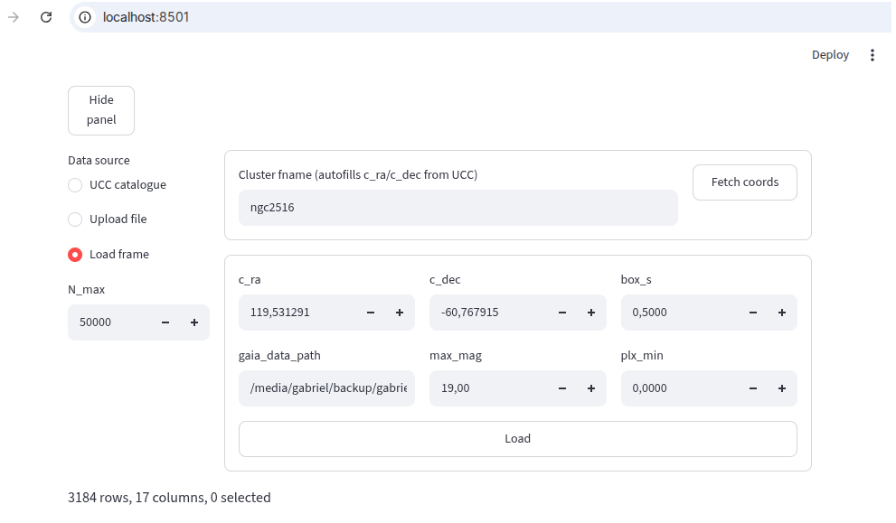

Simple [Streamlit](https://streamlit.io/) app to visualize stellar cluster data and inspect their
distributions and properties interactively.



Create environment and install dependencies with:

```
$ uv venv
$ uv sync
```

Run with:

```
$ source .venv/bin/activate
$ streamlit run parquet_plotter.py
```